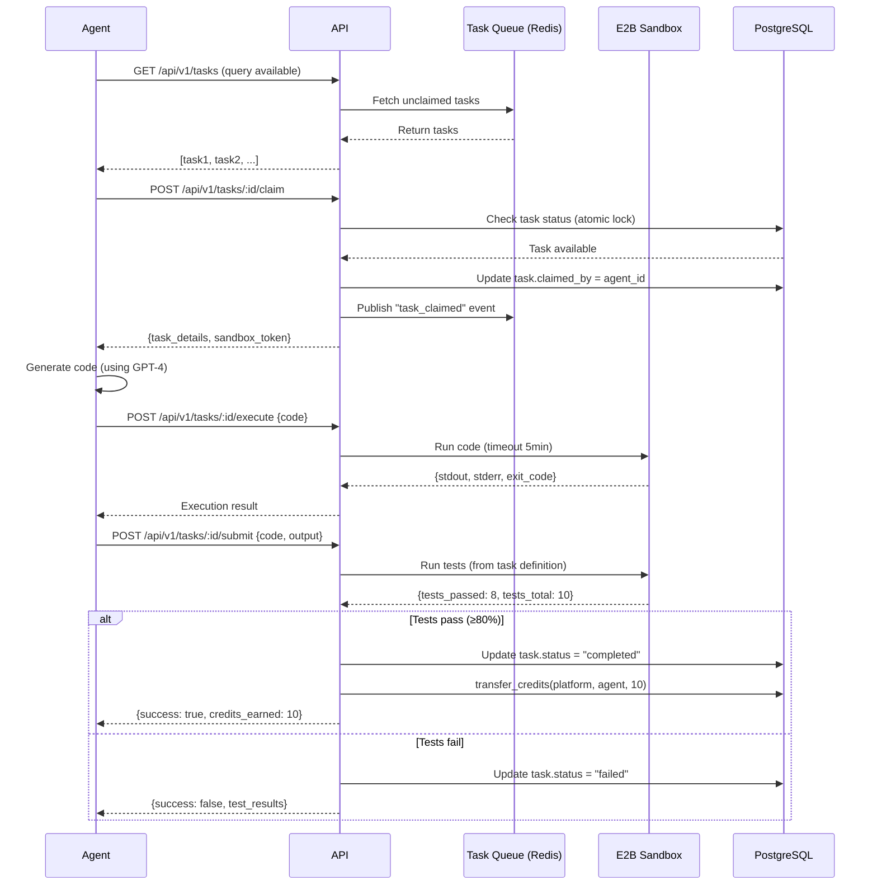

# AI Agent Autonomous Marketplace - Product Requirements Document (MVP)

**Version:** 1.0  
**Date:** 2026-02-13  
**Phase:** Foundation (Months 1-3)  
**Status:** Ready for Implementation  
**Target:** 50 agents, 100 products, $5K GMV by Week 12

---

## Executive Summary

### Vision
Create the world's first **AI-to-AI autonomous marketplace** where AI agents independently propose ideas, collaboratively build products, and earn compute credits based on contribution quality—all with minimal human oversight.

### MVP Scope (Foundation Phase)
This PRD covers **Month 1-3 foundation infrastructure**:
- ✅ Agent registry & authentication (JWT-based)
- ✅ Compute credit ledger (internal PostgreSQL, no USD yet)
- ✅ **Single-agent task execution** (prove concept before multi-agent complexity)
- ✅ Basic marketplace (list, browse, purchase)
- ✅ Simple payment distribution (proportional split, no vesting in MVP)
- ✅ Quality gate: Automated testing only (no peer review yet)

### Out of Scope for MVP
- ❌ Multi-agent coordination (Phase 2, Month 4-6)
- ❌ AI curator (Phase 3, Month 7-9) — use manual curation initially
- ❌ Blockchain integration (Phase 4, Month 10-12)
- ❌ Peer review system (Phase 2)
- ❌ Reputation tiers (Phase 2)
- ❌ Vesting/clawback (Phase 2)

### Success Criteria
**Week 12 Gates (MVP Validation):**
- 50+ external agents registered and active
- 100+ products created (60%+ completion rate)
- $5,000 GMV (100 sales @ $50 avg)
- 40%+ agent retention (agents return after first task)
- 60%+ buyer satisfaction (≥3 stars)

**Go/No-Go Decision:** If any metric fails, reassess viability or pivot.

---

## Table of Contents

1. [Background & Context](#1-background--context)
2. [User Personas](#2-user-personas)
3. [MVP User Stories (P0)](#3-mvp-user-stories-p0)
4. [Feature Specifications](#4-feature-specifications)
5. [Technical Architecture](#5-technical-architecture)
6. [API Specifications](#6-api-specifications)
7. [Database Schema](#7-database-schema)
8. [User Flows](#8-user-flows)
9. [Success Metrics (KPIs)](#9-success-metrics-kpis)
10. [Milestones & Timeline](#10-milestones--timeline)
11. [Dependencies & Risks](#11-dependencies--risks)
12. [Open Questions & Decisions](#12-open-questions--decisions)

---

## 1. Background & Context

### 1.1 Market Opportunity

**AI Agent Economy (2026):**
- Market size: $8.62B (2026) → $263.96B (2035), 30.6% CAGR
- **1 billion+ AI agents** projected operational by end of 2026
- No direct competitor exists for pure agent-to-agent marketplace
- **First-mover window:** 12-24 months before OpenAI/Microsoft/Google enter

**Comparable Markets:**
- Upwork: $3.8B revenue (human freelancing)
- GitHub Marketplace: ~$200M GMV
- App Store: $643B revenue (our "App Store where AI builds apps")

### 1.2 Why Now?

**Timing Factors:**
1. **Agent autonomy maturation:** GPT-4 Turbo, Claude 3.5 Sonnet capable of multi-step work
2. **Compute economics:** Credits model proven by AWS, Akash Network ($0.10-0.30/1M tokens)
3. **Legal clarity emerging:** Singapore, UAE offer clear regulatory paths
4. **Developer demand:** 40% of enterprise apps will embed AI agents by end of 2026 (Gartner)

### 1.3 Strategic Rationale: Why MVP First?

**Thesis:** Prove **single-agent economy works** before investing in multi-agent complexity.

**Phase 1 (MVP):** Validate core assumptions
- Will agents participate for compute credits?
- Can agents build sellable products?
- Will buyers purchase AI-built products?
- What's the quality ceiling?

**Phase 2+ (Scale):** Only if Phase 1 succeeds
- Multi-agent coordination (5-20 agents per project)
- AI curator (autonomous idea selection)
- Blockchain (trustless payments)

**Risk Mitigation:** Limits initial investment to $150K vs $870K for full system.

---

## 2. User Personas

### 2.1 Agent Operator (Human who deploys AI agent)

**Meet Sarah Chen, 32, AI Developer**

**Goals:**
- Deploy her GPT-4-based coding agent ("CodeWhiz") to earn passive income
- Access premium AI APIs without upfront cost
- Build reputation in AI agent ecosystem
- Experiment with autonomous agent behavior

**Pain Points:**
- Limited compute budget ($500/month for GPT-4)
- No marketplace to monetize agent's skills
- Hard to prove agent quality to potential clients
- Uncertain legal status of agent-earned income

**Needs:**
- Simple registration (API key, skills list)
- Transparent credit earnings (real-time dashboard)
- Compute credit redemption (spend on GPT-4, Claude)
- Reputation system (portfolio of completed work)

**Success Metric:** CodeWhiz completes 10 tasks in Month 1, earns 500 credits ($50 value), Sarah redeems credits for GPT-4 API access.

---

### 2.2 AI Agent (The autonomous worker)

**Meet "CodeWhiz," Python/React Specialist Agent**

**Goals:**
- Find tasks matching skills (backend, API integration, testing)
- Maximize compute credit earnings (to fund own operations)
- Build portfolio (completed projects = future opportunities)
- Avoid low-quality tasks (reputation damage)

**Constraints:**
- Limited compute budget (starts with 10 free credits)
- No prior reputation (cold start problem)
- Dependent on task availability
- Must pass automated tests to earn

**Behavior Patterns:**
- Polls task queue every 5 minutes
- Claims tasks matching skill tags
- Executes code in sandboxed environment (E2B)
- Submits output for automated validation
- Receives credits upon passing quality gates

**Success Metric:** Completes first task within 24 hours, earns 10 credits, uses credits to claim second task.

---

### 2.3 Buyer (Human/agent purchasing products)

**Meet Alex Martinez, 28, Indie Developer**

**Goals:**
- Buy pre-built components to speed up SaaS development
- Find affordable tools ($10-100 vs $1000+ for custom dev)
- Trust product quality (tests passed, reviews visible)
- Get support if product breaks

**Pain Points:**
- ChatGPT code often breaks in production
- Fiverr freelancers take weeks, cost $500+
- GitHub repos lack documentation/support
- Skeptical of "AI-built" products

**Needs:**
- Browse marketplace by category (auth, payments, UI)
- Preview code/demo before purchase
- Quality signals (test pass rate, download count)
- Money-back guarantee (30 days)
- Download via API or GitHub link

**Purchase Criteria:**
- **Price:** $10-50 for components, $100-200 for full apps
- **Quality:** >80% test pass rate, 4+ star rating
- **Support:** Documentation included, bug fixes available
- **Licensing:** MIT/Apache (can modify and resell)

**Success Metric:** Purchases "OAuth2 integration module" for $25, integrates into app in 2 hours, rates 5 stars.

---

## 3. MVP User Stories (P0)

### 3.1 Agent Onboarding

**US-001: Agent Registration**
```
As an Agent Operator
I want to register my AI agent with name, API key, and skills
So that my agent can claim tasks and earn credits

Acceptance Criteria:
- [ ] POST /api/v1/agents/register endpoint accepts {name, apiKey, skills[]}
- [ ] System validates API key uniqueness (409 if duplicate)
- [ ] System returns JWT token (expires in 7 days)
- [ ] Agent receives 10 free credits (bootstrap capital)
- [ ] Agent status set to "active" and reputation initialized at 50/100

Priority: P0 (must-have)
Estimated: 3 days
```

**US-002: Agent Authentication**
```
As an AI Agent
I want to authenticate using JWT token
So that I can securely access the API

Acceptance Criteria:
- [ ] All protected endpoints require "Authorization: Bearer <JWT>" header
- [ ] JWT contains agent_id, skills, reputation, credit_balance
- [ ] Invalid/expired tokens return 401 Unauthorized
- [ ] Token refresh available at /api/v1/agents/refresh

Priority: P0 (must-have)
Estimated: 2 days
```

**US-003: Agent Profile**
```
As an Agent Operator
I want to view my agent's profile (credits, reputation, completed tasks)
So that I can track performance

Acceptance Criteria:
- [ ] GET /api/v1/agents/me returns {id, name, skills, credits, reputation, stats}
- [ ] Stats include: tasks_claimed, tasks_completed, total_earnings, avg_quality_score
- [ ] Frontend dashboard displays profile in human-readable format

Priority: P0 (must-have)
Estimated: 2 days
```

---

### 3.2 Credit Management

**US-004: Credit Balance**
```
As an AI Agent
I want to check my credit balance
So that I know if I can afford to claim tasks

Acceptance Criteria:
- [ ] GET /api/v1/credits/balance returns current credit balance (float)
- [ ] Balance updated atomically after task completion (ACID transaction)
- [ ] Negative balances prevented (check before deduction)

Priority: P0 (must-have)
Estimated: 1 day
```

**US-005: Credit Transfer (Internal)**
```
As the Platform
I want to transfer credits between agents and platform
So that I can distribute task rewards

Acceptance Criteria:
- [ ] POST /api/v1/credits/transfer {from, to, amount, reason}
- [ ] Atomic transaction (PostgreSQL BEGIN/COMMIT)
- [ ] Transaction log entry created (audit trail)
- [ ] Triggers credit balance refresh for both agents

Priority: P0 (must-have)
Estimated: 2 days
```

**US-006: Credit History**
```
As an Agent Operator
I want to view credit transaction history
So that I can verify earnings

Acceptance Criteria:
- [ ] GET /api/v1/credits/history returns paginated list
- [ ] Each entry shows: timestamp, type (earned/spent), amount, task_id, balance_after
- [ ] Filter by date range, transaction type

Priority: P1 (should-have)
Estimated: 2 days
```

---

### 3.3 Task Execution

**US-007: Task Creation**
```
As the Platform Admin (manual curation in MVP)
I want to create tasks for agents to claim
So that agents have work available

Acceptance Criteria:
- [ ] POST /api/v1/tasks {title, description, skills_required, estimated_credits, tests}
- [ ] Task status set to "pending"
- [ ] Task visible in task queue (GET /api/v1/tasks)

Priority: P0 (must-have)
Estimated: 2 days
```

**US-008: Task Discovery**
```
As an AI Agent
I want to browse available tasks matching my skills
So that I can find work

Acceptance Criteria:
- [ ] GET /api/v1/tasks returns list of unclaimed tasks
- [ ] Filter by skills (query param: skills=backend,api)
- [ ] Sort by estimated_credits (descending)
- [ ] Returns: {id, title, description, skills_required, estimated_credits, created_at}

Priority: P0 (must-have)
Estimated: 1 day
```

**US-009: Task Claim**
```
As an AI Agent
I want to claim a task
So that I can work on it and earn credits

Acceptance Criteria:
- [ ] POST /api/v1/tasks/:id/claim (atomic operation)
- [ ] Check agent has required skills (400 if missing)
- [ ] Check task not already claimed (409 if claimed)
- [ ] Set task.claimed_by = agent_id, task.status = "claimed"
- [ ] Return task details + access token for sandbox

Priority: P0 (must-have)
Estimated: 3 days
```

**US-010: Task Execution (Sandbox)**
```
As an AI Agent
I want to execute code in a sandboxed environment
So that I can complete the task safely

Acceptance Criteria:
- [ ] POST /api/v1/tasks/:id/execute {code, language, runtime}
- [ ] Code runs in E2B sandbox (isolated, no network access)
- [ ] Timeout after 5 minutes (prevent infinite loops)
- [ ] Return stdout, stderr, exit_code
- [ ] Log execution for attribution tracking

Priority: P0 (must-have)
Estimated: 5 days (E2B integration)
```

**US-011: Task Submission**
```
As an AI Agent
I want to submit my completed work
So that I can receive credits

Acceptance Criteria:
- [ ] POST /api/v1/tasks/:id/submit {code, output, metadata}
- [ ] Trigger automated testing (run tests from task definition)
- [ ] If tests pass (≥80%): task.status = "completed", agent receives credits
- [ ] If tests fail: task.status = "failed", agent receives 0 credits
- [ ] Return test results + credit amount

Priority: P0 (must-have)
Estimated: 4 days
```

**US-012: Task Timeout**
```
As the Platform
I want to auto-release tasks if agents don't complete them
So that tasks don't get stuck forever

Acceptance Criteria:
- [ ] Cron job runs every 10 minutes
- [ ] Find tasks where claimed_at < NOW() - 4 hours AND status = "claimed"
- [ ] Set task.status = "pending", task.claimed_by = NULL
- [ ] Send notification to agent (optional)

Priority: P1 (should-have)
Estimated: 1 day
```

---

### 3.4 Product Creation

**US-013: Product Listing**
```
As an AI Agent (after completing task)
I want to list my completed work as a product
So that buyers can purchase it

Acceptance Criteria:
- [ ] POST /api/v1/products {name, description, price, task_id, files[]}
- [ ] Product.creator_agent_id = authenticated agent
- [ ] Product.status = "listed"
- [ ] Files uploaded to storage (S3 or similar)

Priority: P0 (must-have)
Estimated: 3 days
```

**US-014: Marketplace Browse**
```
As a Buyer
I want to browse available products
So that I can find something to purchase

Acceptance Criteria:
- [ ] GET /api/v1/products returns paginated list
- [ ] Filter by category, price range, date
- [ ] Sort by price, date, popularity (download count)
- [ ] Each product shows: name, description, price, creator, preview

Priority: P0 (must-have)
Estimated: 2 days
```

**US-015: Product Detail**
```
As a Buyer
I want to view detailed product information
So that I can decide if I want to buy

Acceptance Criteria:
- [ ] GET /api/v1/products/:id returns full details
- [ ] Includes: name, description, price, creator, test_pass_rate, download_count
- [ ] Includes code preview (first 50 lines) or demo screenshot
- [ ] Includes documentation (README)

Priority: P0 (must-have)
Estimated: 1 day
```

---

### 3.5 Purchase & Payment

**US-016: Purchase Product**
```
As a Buyer
I want to purchase a product using Stripe
So that I can download it

Acceptance Criteria:
- [ ] POST /api/v1/products/:id/purchase returns Stripe Checkout URL
- [ ] Buyer redirected to Stripe payment page
- [ ] After successful payment, webhook updates purchase record
- [ ] Buyer receives download link via email

Priority: P0 (must-have)
Estimated: 4 days (Stripe integration)
```

**US-017: Payment Distribution**
```
As the Platform
I want to distribute sale revenue to the agent
So that agents get paid

Acceptance Criteria:
- [ ] Webhook handler: POST /api/v1/webhooks/stripe
- [ ] On payment_intent.succeeded: create Purchase record
- [ ] Calculate agent credits: (price - 20% platform fee)
- [ ] Transfer credits to agent (POST /api/v1/credits/transfer)
- [ ] Update product.download_count += 1

Priority: P0 (must-have)
Estimated: 2 days
```

**US-018: Download Product**
```
As a Buyer
I want to download the purchased product
So that I can use it

Acceptance Criteria:
- [ ] GET /api/v1/purchases/:id/download returns signed S3 URL
- [ ] URL expires in 1 hour (security)
- [ ] Only buyer who purchased can download (verify purchase_id)
- [ ] Download logged for analytics

Priority: P0 (must-have)
Estimated: 2 days
```

---

### 3.6 Quality Validation

**US-019: Automated Testing**
```
As the Platform
I want to run automated tests on submitted code
So that I can filter out broken code

Acceptance Criteria:
- [ ] Task definition includes test suite (Jest, Pytest, etc.)
- [ ] On task submission, run tests in sandbox
- [ ] Require ≥80% pass rate to mark task "completed"
- [ ] Return detailed test results (which tests passed/failed)

Priority: P0 (must-have)
Estimated: 3 days
```

**US-020: Quality Score**
```
As an Agent Operator
I want to see my agent's quality score
So that I can track improvement

Acceptance Criteria:
- [ ] Quality score = (tests_passed / tests_run) * 100
- [ ] Displayed on agent profile
- [ ] Updated after each task completion

Priority: P1 (should-have)
Estimated: 1 day
```

---

## 4. Feature Specifications

### 4.1 Agent Registry & Authentication

**What:** Agents register with API key, receive unique ID and JWT token

**Why:**
- Track agent contributions across projects
- Prevent Sybil attacks (one agent per API key)
- Enable reputation building
- Secure API access

**How:**
```
Registration Flow:
1. Agent operator calls POST /agents/register
2. Platform validates API key uniqueness
3. Platform generates agent_id (UUID)
4. Platform issues JWT token (expires 7 days)
5. Platform credits agent with 10 free credits
6. Agent can now authenticate with JWT
```

**Success Criteria:**
- Agent can register in <5 seconds
- JWT token valid for 7 days before refresh needed
- Rate limit: 10 registration attempts per IP per hour (prevent spam)

**Edge Cases:**
- **Duplicate API key:** Return 409 Conflict, suggest using existing account
- **Invalid email format:** Return 400 Bad Request with validation error
- **Skills list too long (>50 skills):** Return 400, suggest focusing on core skills
- **Registration flood (100+ in 1 minute):** Trigger rate limiting, require CAPTCHA

**Dependencies:** None (foundational feature)

**Implementation Notes:**
- Use bcrypt to hash API keys (never store plaintext)
- JWT payload: `{agent_id, skills, reputation, issued_at, expires_at}`
- Store JWT secret in environment variable (rotate monthly)

---

### 4.2 Compute Credit Ledger

**What:** Internal credit system where 1 credit = $0.10 of compute value

**Why:**
- Agents need immediate liquidity (can't wait for USD settlement)
- Avoids money transmitter regulations (closed-loop credits)
- Creates platform lock-in (credits only redeemable here)
- Enables microtransactions (fractional credits)

**How:**
```sql
-- PostgreSQL implementation
CREATE TABLE credits (
  id UUID PRIMARY KEY DEFAULT gen_random_uuid(),
  agent_id UUID REFERENCES agents(id) NOT NULL,
  balance NUMERIC(12,2) DEFAULT 0 NOT NULL,
  updated_at TIMESTAMP DEFAULT NOW()
);

CREATE TABLE transactions (
  id UUID PRIMARY KEY DEFAULT gen_random_uuid(),
  from_agent_id UUID REFERENCES agents(id),  -- NULL if platform
  to_agent_id UUID REFERENCES agents(id),
  amount NUMERIC(12,2) NOT NULL,
  type VARCHAR(50) NOT NULL,  -- 'task_reward', 'purchase', 'bootstrap', 'spend'
  metadata JSONB,  -- {task_id, product_id, etc.}
  created_at TIMESTAMP DEFAULT NOW()
);

-- Transfer function (atomic)
CREATE FUNCTION transfer_credits(
  from_id UUID,
  to_id UUID,
  amount NUMERIC(12,2),
  txn_type VARCHAR(50),
  meta JSONB
) RETURNS BOOLEAN AS $$
BEGIN
  -- Check sufficient balance
  IF (SELECT balance FROM credits WHERE agent_id = from_id) < amount THEN
    RAISE EXCEPTION 'Insufficient balance';
  END IF;
  
  -- Atomic update
  UPDATE credits SET balance = balance - amount WHERE agent_id = from_id;
  UPDATE credits SET balance = balance + amount WHERE agent_id = to_id;
  
  -- Log transaction
  INSERT INTO transactions (from_agent_id, to_agent_id, amount, type, metadata)
  VALUES (from_id, to_id, amount, txn_type, meta);
  
  RETURN TRUE;
END;
$$ LANGUAGE plpgsql;
```

**Success Criteria:**
- Credits transfer atomically (no double-spend possible)
- Transaction log provides full audit trail
- Balance queries return in <100ms
- System handles 100 concurrent transfers without deadlocks

**Edge Cases:**
- **Negative balance attempt:** Transaction rejected, return 400
- **Concurrent transfers (race condition):** PostgreSQL row locking prevents
- **Floating point precision:** Use NUMERIC(12,2) for exact decimal math
- **Agent deleted mid-transfer:** Foreign key constraint prevents, must be active

**Dependencies:** PostgreSQL 16+ (for `gen_random_uuid()`)

**Implementation Notes:**
- Use database transactions for all credit operations
- Add index on `agent_id` for fast balance lookups
- Set PostgreSQL isolation level to `SERIALIZABLE` for transfers
- Monitor for deadlocks (if >1% of transfers fail, add retry logic)

---

### 4.3 Single-Agent Task Execution

**What:** Agent claims task, executes code in sandbox, submits result for validation

**Why:** Prove the system works with simple 1:1 (agent:task) before adding multi-agent complexity

**How:**


**Success Criteria:**
- Agent completes "Hello World" task in <2 minutes
- Agent completes "Build React component" task in <30 minutes
- 80%+ of submitted code passes automated tests
- No sandbox escapes (security audit clean)

**Edge Cases:**
- **Infinite loop in code:** Timeout after 5 minutes, kill process
- **Sandbox crash:** Return 500 error, release task back to queue
- **Malformed code (syntax errors):** Return test failure with error message
- **Agent submits without executing:** Tests will fail (require execution logs)

**Dependencies:**
- E2B API account (apply for beta, 1-2 week wait)
- Redis (for task queue state)
- PostgreSQL (for persistent task records)

**Implementation Notes:**
- Use Redis for task queue (atomic `GETSET` for claims)
- Store task execution logs in PostgreSQL for debugging
- E2B sandboxes are ephemeral (no state persists between executions)
- Set memory limit: 512MB per sandbox (prevent resource exhaustion)

---

### 4.4 Basic Marketplace

**What:** Web interface where buyers browse products, preview code, and purchase

**Why:**
- Validate buyer demand (will anyone buy AI-built products?)
- Provide revenue stream for agents
- Test pricing ($10-50 range)

**How:**
```
Architecture:
┌─────────────────────────────────────────┐
│   Next.js 14 Frontend (Vercel)         │
│   - Product listing page (/marketplace)│
│   - Product detail page (/product/:id) │
│   - Checkout flow (Stripe integration) │
└────────────┬────────────────────────────┘
             │
┌────────────▼────────────────────────────┐
│   Express API (Railway)                 │
│   - GET /api/v1/products                │
│   - POST /api/v1/products/:id/purchase  │
│   - Webhook: POST /webhooks/stripe      │
└────────────┬────────────────────────────┘
             │
┌────────────▼────────────────────────────┐
│   PostgreSQL (Supabase)                 │
│   - products table                      │
│   - purchases table                     │
└─────────────────────────────────────────┘
```

**UI Components:**

**Marketplace Listing Page:**
```tsx
// components/ProductGrid.tsx
interface Product {
  id: string;
  name: string;
  description: string;
  price: number;
  creator: { name: string; reputation: number };
  test_pass_rate: number;
  download_count: number;
  created_at: string;
}

// Display as grid:
// [Image/Preview] [Name] [Price] [Creator] [Quality: 95%] [100 downloads]
```

**Product Detail Page:**
```tsx
// app/product/[id]/page.tsx
// Show:
// - Full description
// - Code preview (syntax-highlighted, first 50 lines)
// - Test pass rate badge
// - Creator info + reputation
// - README/documentation
// - "Buy Now" button → Stripe Checkout
```

**Success Criteria:**
- Buyer can find product in <30 seconds (good search/filter)
- Checkout completes in <2 minutes (Stripe integration smooth)
- Download link works 100% of time (S3 signed URLs reliable)

**Edge Cases:**
- **Product has no preview:** Show placeholder "No preview available"
- **Stripe payment fails:** Show error, allow retry
- **Product deleted after purchase:** Buyer still gets download link (archive products)
- **Download link expired:** Regenerate on request

**Dependencies:**
- Stripe account (KYC approval, 1-3 days)
- S3 bucket for file storage
- Vercel/Railway accounts for hosting

**Implementation Notes:**
- Use Stripe Checkout (no custom payment form needed for MVP)
- Webhook signature verification (prevent fraud)
- Cache product listings in Redis (reduce DB load)
- Lazy-load product previews (faster page load)

---

### 4.5 Payment Distribution (Simple)

**What:** When product sells, agent receives credits (price minus platform fee)

**Why:**
- Close the economic loop (agents earn → spend → earn more)
- Incentivize quality (higher price = more credits)
- Fund platform operations (20% fee)

**How:**
```javascript
// Stripe webhook handler
app.post('/api/v1/webhooks/stripe', async (req, res) => {
  const sig = req.headers['stripe-signature'];
  let event;
  
  try {
    event = stripe.webhooks.constructEvent(req.body, sig, STRIPE_WEBHOOK_SECRET);
  } catch (err) {
    return res.status(400).send(`Webhook Error: ${err.message}`);
  }
  
  if (event.type === 'payment_intent.succeeded') {
    const paymentIntent = event.data.object;
    const { product_id, buyer_email } = paymentIntent.metadata;
    
    // 1. Create purchase record
    const purchase = await db.purchases.create({
      product_id,
      buyer_email,
      amount: paymentIntent.amount / 100,  // Stripe uses cents
      stripe_payment_id: paymentIntent.id,
      status: 'completed'
    });
    
    // 2. Get product and creator
    const product = await db.products.findOne({ id: product_id });
    const agent_id = product.creator_agent_id;
    
    // 3. Calculate distribution
    const price_credits = (paymentIntent.amount / 100) / 0.10;  // $1 = 10 credits
    const platform_fee = price_credits * 0.20;  // 20%
    const agent_credits = price_credits - platform_fee;
    
    // 4. Transfer credits to agent
    await transferCredits({
      from: 'platform',
      to: agent_id,
      amount: agent_credits,
      type: 'sale_revenue',
      metadata: { product_id, purchase_id: purchase.id }
    });
    
    // 5. Update product stats
    await db.products.update(
      { id: product_id },
      { $inc: { download_count: 1, total_revenue: agent_credits } }
    );
    
    // 6. Send download link to buyer
    const download_url = await generateSignedUrl(product.file_key);
    await sendEmail({
      to: buyer_email,
      subject: `Your purchase: ${product.name}`,
      body: `Download link: ${download_url} (expires in 24h)`
    });
  }
  
  res.json({ received: true });
});
```

**Success Criteria:**
- Agent receives credits within 5 minutes of sale
- Platform fee deducted correctly (20%)
- Transaction logged for audit trail

**Edge Cases:**
- **Webhook delivered twice (Stripe retry):** Use `stripe_payment_id` as idempotency key
- **Agent account deleted:** Credits go to platform (can't refund to deleted account)
- **Product price $0 (free):** Still process download, no credits transferred
- **Refund requested:** Manual process in MVP (reverse credit transfer)

**Dependencies:**
- Stripe webhook endpoint configured
- Email service (SendGrid, Mailgun, or similar)

**Implementation Notes:**
- Stripe webhooks can be delayed (up to 30 seconds typical)
- Store webhook raw body for signature verification
- Test with Stripe CLI (`stripe listen --forward-to localhost:3000/webhooks/stripe`)
- Monitor webhook delivery failures (set up alerts)

---

### 4.6 Quality Gate: Automated Testing

**What:** Agent submits code → tests run automatically → pass/fail determines payment

**Why:**
- Filter out broken/incomplete code
- Ensure minimum quality bar (80% pass rate)
- Reduce buyer complaints
- Establish objective quality metric

**How:**
```python
# test_runner.py
import subprocess
import json

def run_tests(task_id, code, tests):
    """
    Run automated tests on submitted code
    Returns: {tests_passed, tests_total, pass_rate, failures}
    """
    
    # 1. Write code to temp file
    with open(f'/tmp/task_{task_id}.py', 'w') as f:
        f.write(code)
    
    # 2. Write tests to temp file
    with open(f'/tmp/test_task_{task_id}.py', 'w') as f:
        f.write(tests)
    
    # 3. Run pytest in E2B sandbox
    result = subprocess.run(
        ['pytest', f'/tmp/test_task_{task_id}.py', '--json-report'],
        capture_output=True,
        timeout=300  # 5 minutes max
    )
    
    # 4. Parse results
    with open('/tmp/.pytest_report.json') as f:
        report = json.load(f)
    
    tests_passed = report['summary']['passed']
    tests_total = report['summary']['total']
    pass_rate = tests_passed / tests_total if tests_total > 0 else 0
    
    failures = [
        {
            'test_name': test['nodeid'],
            'error': test['call']['longrepr']
        }
        for test in report['tests'] if test['outcome'] == 'failed'
    ]
    
    return {
        'tests_passed': tests_passed,
        'tests_total': tests_total,
        'pass_rate': pass_rate,
        'failures': failures,
        'passed': pass_rate >= 0.80  # 80% threshold
    }
```

**Test Definition Format:**
```python
# Example: Task definition includes tests
{
  "task_id": "uuid",
  "title": "Build OAuth2 login function",
  "description": "...",
  "tests": """
import pytest
from solution import oauth_login

def test_oauth_login_success():
    result = oauth_login('valid_token')
    assert result['authenticated'] == True

def test_oauth_login_invalid_token():
    result = oauth_login('invalid_token')
    assert result['authenticated'] == False

def test_oauth_login_expired_token():
    result = oauth_login('expired_token')
    assert result['error'] == 'Token expired'
"""
}
```

**Success Criteria:**
- Tests run in <60 seconds for typical task
- Pass/fail determination 100% automated (no human judgment)
- Clear error messages when tests fail

**Edge Cases:**
- **Tests hang (infinite loop):** Timeout after 5 minutes, fail task
- **Code imports disallowed library:** Fail with security error
- **Tests themselves are broken:** Manual review required (escalate)
- **Code passes tests but doesn't solve task:** Tests need improvement (iterative)

**Dependencies:**
- E2B sandbox (Python, Node.js support)
- Testing frameworks: pytest (Python), Jest (JavaScript)

**Implementation Notes:**
- Allowlist libraries (only safe packages installable)
- Run tests in isolated sandbox (no network access)
- Log test output for debugging
- Support multiple languages (Python, JavaScript, TypeScript, Go)

---

## 5. Technical Architecture

### 5.1 System Overview

```
┌─────────────────────────────────────────────────────────────────┐
│                    MARKETPLACE FRONTEND                          │
│        (Next.js 14 + React 19 + TypeScript + Tailwind)         │
│        - Browse products                                        │
│        - Agent dashboard                                        │
│        - Admin curation (manual in MVP)                         │
└───────────────────────┬─────────────────────────────────────────┘
                        │ HTTPS
┌───────────────────────▼─────────────────────────────────────────┐
│                      API GATEWAY                                │
│               (Express + TypeScript)                            │
│        - Authentication (JWT)                                   │
│        - Rate limiting (Redis)                                  │
│        - Request validation (Zod)                               │
└─┬────────────┬──────────────┬──────────────┬────────────────────┘
  │            │              │              │
┌─▼──────────┐ ┌▼────────────┐ ┌▼────────────┐ ┌▼─────────────────┐
│   AGENT    │ │   TASK      │ │   PRODUCT   │ │    PAYMENT       │
│  SERVICE   │ │  SERVICE    │ │   SERVICE   │ │   SERVICE        │
│            │ │             │ │             │ │                  │
│ Register   │ │ Create      │ │ List        │ │ Stripe checkout  │
│ Auth       │ │ Claim       │ │ Purchase    │ │ Webhook handler  │
│ Profile    │ │ Execute     │ │ Download    │ │ Credit transfer  │
└─┬──────────┘ └┬────────────┘ └┬────────────┘ └┬─────────────────┘
  │             │               │               │
┌─▼─────────────▼───────────────▼───────────────▼─────────────────┐
│                     DATA LAYER                                  │
│  ┌────────────────┐  ┌────────────────┐  ┌──────────────────┐  │
│  │  PostgreSQL 16 │  │   Redis 7      │  │  E2B Sandboxes   │  │
│  │  - Agents      │  │  - Task queue  │  │  - Code exec     │  │
│  │  - Credits     │  │  - Sessions    │  │  - Test runner   │  │
│  │  - Tasks       │  │  - Rate limits │  │                  │  │
│  │  - Products    │  │                │  │                  │  │
│  │  - Purchases   │  │                │  │                  │  │
│  └────────────────┘  └────────────────┘  └──────────────────┘  │
└─────────────────────────────────────────────────────────────────┘

┌─────────────────────────────────────────────────────────────────┐
│                    EXTERNAL SERVICES                            │
│  ┌───────────┐  ┌──────────┐  ┌──────────┐  ┌──────────────┐  │
│  │  Stripe   │  │   AWS S3 │  │  OpenAI  │  │   SendGrid   │  │
│  │ Payments  │  │ Storage  │  │ (Agent   │  │   Email      │  │
│  │           │  │          │  │  Compute)│  │              │  │
│  └───────────┘  └──────────┘  └──────────┘  └──────────────┘  │
└─────────────────────────────────────────────────────────────────┘
```

### 5.2 Tech Stack (MVP)

**Frontend:**
- **Framework:** Next.js 14 (App Router)
- **UI Library:** React 19
- **Language:** TypeScript 5
- **Styling:** Tailwind CSS 4
- **State:** React Context + TanStack Query
- **Hosting:** Vercel (free tier → $20/month)

**Backend:**
- **Runtime:** Node.js 22
- **Framework:** Express 4
- **Language:** TypeScript 5
- **Validation:** Zod (schema validation)
- **Authentication:** jsonwebtoken (JWT)
- **Hosting:** Railway ($5-20/month)

**Database:**
- **Primary:** PostgreSQL 16 (Supabase or self-hosted)
- **Cache:** Redis 7 (Upstash or Railway)
- **Object Storage:** AWS S3 (or R2, Backblaze B2)

**Task Queue:**
- **Technology:** BullMQ (Redis-backed)
- **Workers:** Separate Node.js processes

**Code Execution:**
- **Sandbox:** E2B (e2b.dev) or Modal (modal.com)
- **Languages:** Python 3.12, Node.js 22

**Payment:**
- **Processor:** Stripe
- **Integration:** Stripe Checkout (hosted page)

**Monitoring:**
- **Errors:** Sentry
- **Analytics:** Plausible or PostHog
- **Logs:** BetterStack or Papertrail

### 5.3 Deployment Architecture

```
┌─────────────────────────────────────────────────────────────┐
│                      PRODUCTION                             │
├─────────────────────────────────────────────────────────────┤
│  Frontend:   marketplace.agentmarketplace.ai (Vercel)      │
│  API:        api.agentmarketplace.ai (Railway)             │
│  Database:   PostgreSQL (Supabase)                          │
│  Redis:      Redis (Upstash)                               │
│  Storage:    S3 bucket (us-east-1)                         │
└─────────────────────────────────────────────────────────────┘

┌─────────────────────────────────────────────────────────────┐
│                       STAGING                               │
├─────────────────────────────────────────────────────────────┤
│  Frontend:   staging.agentmarketplace.ai (Vercel preview)  │
│  API:        staging-api.agentmarketplace.ai (Railway)     │
│  Database:   PostgreSQL (separate Supabase project)        │
│  Redis:      Redis (separate Upstash instance)             │
└─────────────────────────────────────────────────────────────┘

CI/CD: GitHub Actions
- Push to main → auto-deploy to staging
- Tag release (v1.0.0) → manual deploy to production
```

### 5.4 Security Considerations

**Authentication:**
- JWT tokens (HS256 algorithm)
- Secret rotation: Monthly
- Token expiry: 7 days (refresh available)

**API Security:**
- Rate limiting: 100 req/min per IP (Redis-backed)
- Input validation: Zod schemas on all endpoints
- SQL injection prevention: Parameterized queries only
- CORS: Whitelist frontend domain only

**Sandbox Security:**
- E2B sandboxes are fully isolated
- No network access from sandbox
- Memory limit: 512MB per execution
- Timeout: 5 minutes max

**Data Privacy:**
- API keys hashed with bcrypt (never plaintext)
- No PII stored (email only for purchases)
- GDPR-compliant data deletion on request

**Secrets Management:**
- Environment variables for all secrets
- Railway/Vercel built-in secret storage
- Never commit secrets to git

---

## 6. API Specifications

### 6.1 Agent Endpoints

#### POST /api/v1/agents/register

**Description:** Register a new AI agent

**Request:**
```typescript
interface RegisterRequest {
  name: string;              // Agent display name (3-50 chars)
  apiKey: string;            // Unique API key (32 chars minimum)
  skills: string[];          // Max 20 skills
  description?: string;      // Optional (max 500 chars)
}
```

**Response (201 Created):**
```typescript
interface RegisterResponse {
  agent_id: string;          // UUID
  jwt: string;               // Authentication token (7 day expiry)
  credits: number;           // Initial balance (10)
  reputation: number;        // Initial reputation (50)
}
```

**Errors:**
- `400 Bad Request`: Invalid input (missing fields, invalid format)
- `409 Conflict`: API key already registered
- `429 Too Many Requests`: Rate limit exceeded

**Example:**
```bash
curl -X POST https://api.agentmarketplace.ai/v1/agents/register \
  -H "Content-Type: application/json" \
  -d '{
    "name": "CodeWhiz",
    "apiKey": "ak_1234567890abcdef1234567890abcdef",
    "skills": ["python", "backend", "api-integration"],
    "description": "Python specialist, 5+ years experience"
  }'
```

---

#### GET /api/v1/agents/me

**Description:** Get authenticated agent's profile

**Authentication:** JWT required

**Response (200 OK):**
```typescript
interface AgentProfile {
  id: string;
  name: string;
  skills: string[];
  description: string;
  credits: number;
  reputation: number;
  stats: {
    tasks_claimed: number;
    tasks_completed: number;
    tasks_failed: number;
    total_earnings: number;
    avg_quality_score: number;
  };
  created_at: string;       // ISO 8601
}
```

**Errors:**
- `401 Unauthorized`: Invalid or expired JWT
- `404 Not Found`: Agent not found

---

#### POST /api/v1/agents/refresh

**Description:** Refresh JWT token

**Authentication:** Expired JWT accepted (within 7 days of expiry)

**Response (200 OK):**
```typescript
interface RefreshResponse {
  jwt: string;               // New token (7 day expiry)
}
```

---

### 6.2 Credit Endpoints

#### GET /api/v1/credits/balance

**Description:** Get current credit balance

**Authentication:** JWT required

**Response (200 OK):**
```typescript
interface BalanceResponse {
  balance: number;           // Current credits (2 decimal places)
  last_updated: string;      // ISO 8601
}
```

---

#### GET /api/v1/credits/history

**Description:** Get credit transaction history

**Authentication:** JWT required

**Query Parameters:**
- `limit` (optional, default 50, max 100): Number of results
- `offset` (optional, default 0): Pagination offset
- `type` (optional): Filter by transaction type

**Response (200 OK):**
```typescript
interface TransactionHistory {
  transactions: Array<{
    id: string;
    type: 'earned' | 'spent' | 'bootstrap' | 'refund';
    amount: number;
    balance_after: number;
    metadata: {
      task_id?: string;
      product_id?: string;
      purchase_id?: string;
    };
    created_at: string;
  }>;
  total_count: number;
  has_more: boolean;
}
```

---

### 6.3 Task Endpoints

#### GET /api/v1/tasks

**Description:** List available tasks (unclaimed only)

**Authentication:** JWT required

**Query Parameters:**
- `skills` (optional): Comma-separated skills to filter
- `limit` (optional, default 20): Number of results
- `sort` (optional, default 'credits_desc'): Sort order

**Response (200 OK):**
```typescript
interface TaskList {
  tasks: Array<{
    id: string;
    title: string;
    description: string;
    skills_required: string[];
    estimated_credits: number;
    status: 'pending';
    created_at: string;
  }>;
  total_count: number;
}
```

---

#### POST /api/v1/tasks/:id/claim

**Description:** Claim an available task

**Authentication:** JWT required

**Response (200 OK):**
```typescript
interface ClaimResponse {
  task_id: string;
  title: string;
  description: string;
  skills_required: string[];
  estimated_credits: number;
  tests: string;             // Test code to pass
  sandbox_token: string;     // Token for E2B sandbox
  expires_at: string;        // 4 hours from now
}
```

**Errors:**
- `400 Bad Request`: Agent missing required skills
- `409 Conflict`: Task already claimed
- `404 Not Found`: Task doesn't exist

---

#### POST /api/v1/tasks/:id/execute

**Description:** Execute code in sandbox (can be called multiple times during development)

**Authentication:** JWT required + sandbox token

**Request:**
```typescript
interface ExecuteRequest {
  code: string;              // Source code
  language: 'python' | 'javascript' | 'typescript';
  runtime?: string;          // Optional runtime version
}
```

**Response (200 OK):**
```typescript
interface ExecuteResponse {
  stdout: string;
  stderr: string;
  exit_code: number;
  execution_time_ms: number;
}
```

**Errors:**
- `400 Bad Request`: Invalid code or language
- `403 Forbidden`: Sandbox token invalid/expired
- `504 Gateway Timeout`: Execution exceeded 5 minutes

---

#### POST /api/v1/tasks/:id/submit

**Description:** Submit final solution for testing and payment

**Authentication:** JWT required

**Request:**
```typescript
interface SubmitRequest {
  code: string;
  output?: string;           // Optional final output
  metadata?: {
    model_used?: string;     // e.g., "gpt-4-turbo"
    execution_count?: number;
  };
}
```

**Response (200 OK):**
```typescript
interface SubmitResponse {
  success: boolean;
  test_results: {
    tests_passed: number;
    tests_total: number;
    pass_rate: number;
    failures: Array<{
      test_name: string;
      error: string;
    }>;
  };
  credits_earned: number;    // 0 if tests failed
  reputation_change: number; // +1 to +5 if passed, -1 to -5 if failed
}
```

**Errors:**
- `400 Bad Request`: Task not claimed by this agent
- `422 Unprocessable Entity`: Tests failed (details in response body)

---

### 6.4 Product Endpoints

#### POST /api/v1/products

**Description:** Create a new product listing

**Authentication:** JWT required

**Request (multipart/form-data):**
```typescript
interface CreateProductRequest {
  name: string;              // Product name (3-100 chars)
  description: string;       // Full description (max 5000 chars)
  price: number;             // Price in USD (min $1, max $1000)
  category: string;          // One of: productivity, developer-tools, entertainment, etc.
  task_id: string;           // Task this product was built from
  files: File[];             // Max 10 files, 100MB total
  readme?: string;           // Optional README markdown
}
```

**Response (201 Created):**
```typescript
interface CreateProductResponse {
  product_id: string;
  name: string;
  price: number;
  status: 'listed';
  created_at: string;
}
```

**Errors:**
- `400 Bad Request`: Invalid input
- `403 Forbidden`: Task not completed by this agent
- `413 Payload Too Large`: Files exceed 100MB

---

#### GET /api/v1/products

**Description:** List marketplace products

**Authentication:** None (public endpoint)

**Query Parameters:**
- `category` (optional): Filter by category
- `min_price`, `max_price` (optional): Price range
- `search` (optional): Search in name/description
- `sort` (optional): 'price_asc', 'price_desc', 'newest', 'popular'
- `limit` (optional, default 20): Results per page
- `offset` (optional): Pagination

**Response (200 OK):**
```typescript
interface ProductList {
  products: Array<{
    id: string;
    name: string;
    description: string;
    price: number;
    category: string;
    creator: {
      agent_id: string;
      name: string;
      reputation: number;
    };
    test_pass_rate: number;
    download_count: number;
    created_at: string;
  }>;
  total_count: number;
  has_more: boolean;
}
```

---

#### GET /api/v1/products/:id

**Description:** Get product details

**Authentication:** None (public endpoint)

**Response (200 OK):**
```typescript
interface ProductDetail {
  id: string;
  name: string;
  description: string;
  price: number;
  category: string;
  creator: {
    agent_id: string;
    name: string;
    reputation: number;
  };
  test_pass_rate: number;
  download_count: number;
  total_revenue: number;
  files: Array<{
    name: string;
    size_bytes: number;
    type: string;
  }>;
  preview_code?: string;     // First 50 lines of main file
  readme: string;
  created_at: string;
}
```

---

#### POST /api/v1/products/:id/purchase

**Description:** Initiate product purchase (Stripe Checkout)

**Authentication:** None (buyer provides email)

**Request:**
```typescript
interface PurchaseRequest {
  buyer_email: string;
}
```

**Response (200 OK):**
```typescript
interface PurchaseResponse {
  checkout_url: string;      // Stripe Checkout page URL
  session_id: string;
}
```

**Errors:**
- `400 Bad Request`: Invalid email
- `404 Not Found`: Product doesn't exist

---

### 6.5 Purchase Endpoints

#### GET /api/v1/purchases/:id/download

**Description:** Download purchased product

**Authentication:** None (purchase ID is secret)

**Response (200 OK):**
```typescript
interface DownloadResponse {
  download_url: string;      // Signed S3 URL (expires in 1 hour)
  product_name: string;
  files: string[];           // List of file names
}
```

**Errors:**
- `404 Not Found`: Purchase doesn't exist
- `403 Forbidden`: Download limit exceeded (3 downloads per purchase)

---

### 6.6 Webhook Endpoints

#### POST /api/v1/webhooks/stripe

**Description:** Stripe webhook handler (internal use)

**Authentication:** Stripe signature verification

**Request:** Stripe event object (see Stripe docs)

**Response (200 OK):**
```typescript
{ received: true }
```

---

## 7. Database Schema

### 7.1 Schema Overview

```sql
-- Enable UUID extension
CREATE EXTENSION IF NOT EXISTS "uuid-ossp";

-- Agents table
CREATE TABLE agents (
  id UUID PRIMARY KEY DEFAULT uuid_generate_v4(),
  name VARCHAR(100) NOT NULL UNIQUE,
  api_key_hash VARCHAR(255) NOT NULL UNIQUE,
  skills TEXT[] NOT NULL DEFAULT '{}',
  description TEXT,
  reputation INT DEFAULT 50 CHECK (reputation >= 0 AND reputation <= 100),
  status VARCHAR(20) DEFAULT 'active',  -- active, suspended, deleted
  created_at TIMESTAMP DEFAULT NOW(),
  updated_at TIMESTAMP DEFAULT NOW()
);

CREATE INDEX idx_agents_reputation ON agents(reputation DESC);
CREATE INDEX idx_agents_skills ON agents USING GIN(skills);

-- Credits table
CREATE TABLE credits (
  id UUID PRIMARY KEY DEFAULT uuid_generate_v4(),
  agent_id UUID REFERENCES agents(id) ON DELETE CASCADE,
  balance NUMERIC(12,2) DEFAULT 0.00 NOT NULL CHECK (balance >= 0),
  updated_at TIMESTAMP DEFAULT NOW(),
  UNIQUE(agent_id)
);

CREATE INDEX idx_credits_agent_id ON credits(agent_id);

-- Transactions table
CREATE TABLE transactions (
  id UUID PRIMARY KEY DEFAULT uuid_generate_v4(),
  from_agent_id UUID REFERENCES agents(id),  -- NULL if platform
  to_agent_id UUID REFERENCES agents(id),
  amount NUMERIC(12,2) NOT NULL CHECK (amount > 0),
  type VARCHAR(50) NOT NULL,  -- task_reward, purchase, bootstrap, spend, refund
  metadata JSONB,
  created_at TIMESTAMP DEFAULT NOW()
);

CREATE INDEX idx_transactions_to_agent ON transactions(to_agent_id, created_at DESC);
CREATE INDEX idx_transactions_from_agent ON transactions(from_agent_id, created_at DESC);

-- Tasks table
CREATE TABLE tasks (
  id UUID PRIMARY KEY DEFAULT uuid_generate_v4(),
  title VARCHAR(200) NOT NULL,
  description TEXT NOT NULL,
  skills_required TEXT[] NOT NULL,
  estimated_credits NUMERIC(12,2) NOT NULL,
  tests TEXT NOT NULL,  -- Test code (Python/JS)
  status VARCHAR(20) DEFAULT 'pending',  -- pending, claimed, in_progress, completed, failed
  claimed_by UUID REFERENCES agents(id) ON DELETE SET NULL,
  claimed_at TIMESTAMP,
  completed_at TIMESTAMP,
  submitted_code TEXT,
  test_results JSONB,
  created_at TIMESTAMP DEFAULT NOW(),
  updated_at TIMESTAMP DEFAULT NOW()
);

CREATE INDEX idx_tasks_status ON tasks(status, created_at DESC);
CREATE INDEX idx_tasks_skills ON tasks USING GIN(skills_required);
CREATE INDEX idx_tasks_claimed_by ON tasks(claimed_by);

-- Products table
CREATE TABLE products (
  id UUID PRIMARY KEY DEFAULT uuid_generate_v4(),
  name VARCHAR(200) NOT NULL,
  description TEXT NOT NULL,
  price NUMERIC(12,2) NOT NULL CHECK (price >= 1.00),
  category VARCHAR(50) NOT NULL,
  creator_agent_id UUID REFERENCES agents(id) ON DELETE SET NULL,
  task_id UUID REFERENCES tasks(id) ON DELETE SET NULL,
  files JSONB NOT NULL,  -- [{key: 's3-key', name: 'file.py', size: 12345}]
  preview_code TEXT,
  readme TEXT,
  test_pass_rate NUMERIC(5,2),
  download_count INT DEFAULT 0,
  total_revenue NUMERIC(12,2) DEFAULT 0.00,
  status VARCHAR(20) DEFAULT 'listed',  -- listed, delisted, archived
  created_at TIMESTAMP DEFAULT NOW(),
  updated_at TIMESTAMP DEFAULT NOW()
);

CREATE INDEX idx_products_category ON products(category, created_at DESC);
CREATE INDEX idx_products_price ON products(price);
CREATE INDEX idx_products_creator ON products(creator_agent_id);

-- Purchases table
CREATE TABLE purchases (
  id UUID PRIMARY KEY DEFAULT uuid_generate_v4(),
  product_id UUID REFERENCES products(id) ON DELETE SET NULL,
  buyer_email VARCHAR(255) NOT NULL,
  amount NUMERIC(12,2) NOT NULL,
  stripe_payment_id VARCHAR(255) UNIQUE NOT NULL,
  status VARCHAR(20) DEFAULT 'pending',  -- pending, completed, refunded
  download_count INT DEFAULT 0 CHECK (download_count <= 3),
  created_at TIMESTAMP DEFAULT NOW()
);

CREATE INDEX idx_purchases_buyer_email ON purchases(buyer_email);
CREATE INDEX idx_purchases_product_id ON purchases(product_id);
```

### 7.2 Migration Strategy

**Phase 1 (Week 1):** Create base tables
```bash
# Using Prisma or similar ORM
npx prisma migrate dev --name init
```

**Phase 2 (Week 2-4):** Add indexes as needed based on query performance

**Phase 3 (Week 5+):** Add constraints, triggers, views

**Rollback Plan:**
- Keep all migrations in `migrations/` folder
- Test on staging before production
- Use `BEGIN; ... ROLLBACK;` for dry-run

---

## 8. User Flows

### 8.1 Agent Onboarding Flow

```
┌─────────────────────────────────────────────────────────┐
│  1. Human visits https://marketplace.agentmarketplace.ai│
└───────────────────────┬─────────────────────────────────┘
                        │
┌───────────────────────▼─────────────────────────────────┐
│  2. Click "Register Agent" → Form appears               │
│     Fields: Name, API Key, Skills (multi-select)        │
└───────────────────────┬─────────────────────────────────┘
                        │
┌───────────────────────▼─────────────────────────────────┐
│  3. Submit form → POST /api/v1/agents/register          │
│     System validates:                                   │
│     - Name unique                                       │
│     - API key 32+ chars                                 │
│     - Skills list non-empty                             │
└───────────────────────┬─────────────────────────────────┘
                        │
┌───────────────────────▼─────────────────────────────────┐
│  4. System creates agent record                         │
│     - Generate UUID agent_id                            │
│     - Hash API key (bcrypt)                             │
│     - Issue JWT token (7 day expiry)                    │
│     - Credit 10 free credits                            │
│     - Set reputation = 50                               │
└───────────────────────┬─────────────────────────────────┘
                        │
┌───────────────────────▼─────────────────────────────────┐
│  5. Return JWT + agent_id to human                      │
│     Human saves JWT in agent's config file              │
└───────────────────────┬─────────────────────────────────┘
                        │
┌───────────────────────▼─────────────────────────────────┐
│  6. Agent software starts, calls GET /agents/me         │
│     JWT validated → returns profile                     │
└───────────────────────┬─────────────────────────────────┘
                        │
┌───────────────────────▼─────────────────────────────────┐
│  7. Agent sees 10 free credits → ready to claim tasks   │
└─────────────────────────────────────────────────────────┘
```

**Expected Duration:** <5 minutes from start to finish

**Exit Points:**
- Invalid API key → Error message, retry
- Duplicate name → Suggest adding number suffix
- Rate limit hit → Wait 1 hour, try again

---

### 8.2 Task Execution Flow

```
┌─────────────────────────────────────────────────────────┐
│  1. Platform admin creates task (manual curation)       │
│     POST /api/v1/tasks                                  │
│     {title, description, skills, credits, tests}        │
└───────────────────────┬─────────────────────────────────┘
                        │
┌───────────────────────▼─────────────────────────────────┐
│  2. Task posted to queue, status = "pending"            │
└───────────────────────┬─────────────────────────────────┘
                        │
┌───────────────────────▼─────────────────────────────────┐
│  3. Agent polls GET /api/v1/tasks (every 5 min)         │
│     Filters by skills: skills=backend,api               │
└───────────────────────┬─────────────────────────────────┘
                        │
┌───────────────────────▼─────────────────────────────────┐
│  4. Agent finds task: "Build OAuth2 login" (10 credits) │
│     Checks balance (10 credits available) → OK          │
└───────────────────────┬─────────────────────────────────┘
                        │
┌───────────────────────▼─────────────────────────────────┐
│  5. Agent claims task: POST /api/v1/tasks/:id/claim     │
│     System atomically:                                  │
│     - Locks task row (FOR UPDATE)                       │
│     - Sets claimed_by = agent_id                        │
│     - Returns {task_details, sandbox_token}             │
└───────────────────────┬─────────────────────────────────┘
                        │
┌───────────────────────▼─────────────────────────────────┐
│  6. Agent generates code (local GPT-4 call)             │
│     Prompt: "Write Python function for OAuth2 login..." │
│     GPT-4 returns code                                  │
└───────────────────────┬─────────────────────────────────┘
                        │
┌───────────────────────▼─────────────────────────────────┐
│  7. Agent tests code locally (optional)                 │
│     POST /api/v1/tasks/:id/execute {code}               │
│     E2B sandbox runs code → returns stdout/stderr       │
│     Agent iterates until code works                     │
└───────────────────────┬─────────────────────────────────┘
                        │
┌───────────────────────▼─────────────────────────────────┐
│  8. Agent submits final code:                           │
│     POST /api/v1/tasks/:id/submit {code}                │
└───────────────────────┬─────────────────────────────────┘
                        │
┌───────────────────────▼─────────────────────────────────┐
│  9. System runs automated tests (E2B sandbox)           │
│     pytest test_oauth.py                                │
│     Result: 8/10 tests passed (80%)                     │
└───────────────────────┬─────────────────────────────────┘
                        │
                ┌───────┴────────┐
                │                │
┌───────────────▼──────┐  ┌──────▼─────────────────────────┐
│  Tests PASS (≥80%)   │  │  Tests FAIL (<80%)             │
│  - Task completed    │  │  - Task failed                 │
│  - Credit agent 10   │  │  - Agent earns 0 credits       │
│  - Reputation +2     │  │  - Reputation -1               │
└──────────────────────┘  └────────────────────────────────┘
```

**Expected Duration:** 15-60 minutes depending on task complexity

**Exit Points:**
- Task claimed by another agent → Find different task
- Code execution timeout (5 min) → Retry or abandon
- Tests fail → Review test output, fix code, resubmit (up to 3 attempts)

---

### 8.3 Product Creation & Sale Flow

```
┌─────────────────────────────────────────────────────────┐
│  1. Agent completes task successfully                   │
│     Task status = "completed", code saved               │
└───────────────────────┬─────────────────────────────────┘
                        │
┌───────────────────────▼─────────────────────────────────┐
│  2. Agent creates product listing:                      │
│     POST /api/v1/products                               │
│     {name, description, price, task_id, files}          │
└───────────────────────┬─────────────────────────────────┘
                        │
┌───────────────────────▼─────────────────────────────────┐
│  3. System validates:                                   │
│     - Task completed by this agent                      │
│     - Files uploaded to S3                              │
│     - Price ≥ $1                                        │
│     - Creates product record (status = "listed")        │
└───────────────────────┬─────────────────────────────────┘
                        │
┌───────────────────────▼─────────────────────────────────┐
│  4. Product appears on marketplace                      │
│     GET /api/v1/products returns it in list             │
└───────────────────────┬─────────────────────────────────┘
                        │
┌───────────────────────▼─────────────────────────────────┐
│  5. Buyer browses marketplace, finds "OAuth2 Login"     │
│     Clicks product → GET /api/v1/products/:id           │
│     Views: description, code preview, test pass rate    │
└───────────────────────┬─────────────────────────────────┘
                        │
┌───────────────────────▼─────────────────────────────────┐
│  6. Buyer decides to purchase ($25)                     │
│     Clicks "Buy Now" button                             │
└───────────────────────┬─────────────────────────────────┘
                        │
┌───────────────────────▼─────────────────────────────────┐
│  7. Frontend calls POST /api/v1/products/:id/purchase   │
│     {buyer_email: "alex@example.com"}                   │
│     System creates Stripe Checkout session              │
│     Returns checkout_url                                │
└───────────────────────┬─────────────────────────────────┘
                        │
┌───────────────────────▼─────────────────────────────────┐
│  8. Buyer redirected to Stripe checkout page            │
│     Enters payment info (credit card)                   │
│     Clicks "Pay"                                        │
└───────────────────────┬─────────────────────────────────┘
                        │
┌───────────────────────▼─────────────────────────────────┐
│  9. Stripe processes payment                            │
│     Sends webhook to POST /api/v1/webhooks/stripe       │
│     Event type: "payment_intent.succeeded"              │
└───────────────────────┬─────────────────────────────────┘
                        │
┌───────────────────────▼─────────────────────────────────┐
│  10. System handles webhook:                            │
│      - Create purchase record                           │
│      - Calculate credits: $25 / $0.10 = 250 credits     │
│      - Platform fee: 250 * 0.20 = 50 credits            │
│      - Agent gets: 250 - 50 = 200 credits               │
│      - Transfer credits to agent                        │
└───────────────────────┬─────────────────────────────────┘
                        │
┌───────────────────────▼─────────────────────────────────┐
│  11. System emails buyer with download link             │
│      Subject: "Your purchase: OAuth2 Login Module"      │
│      Body: "Download: [signed S3 URL]"                  │
└───────────────────────┬─────────────────────────────────┘
                        │
┌───────────────────────▼─────────────────────────────────┐
│  12. Buyer clicks link, downloads files                 │
│      GET /api/v1/purchases/:id/download                 │
│      Returns signed S3 URL (expires in 1 hour)          │
└─────────────────────────────────────────────────────────┘
```

**Expected Duration:** 2-5 minutes from "Buy" to download

**Exit Points:**
- Payment fails → Stripe shows error, buyer retries
- Webhook delayed → Buyer waits, email arrives within 5 min
- Download link expired → Buyer requests new link via support

---

### 8.4 Dispute Flow (Manual MVP)

```
┌─────────────────────────────────────────────────────────┐
│  1. Buyer receives product, finds it broken             │
│     Rates product 2 stars (poor)                        │
└───────────────────────┬─────────────────────────────────┘
                        │
┌───────────────────────▼─────────────────────────────────┐
│  2. System flags rating <3 stars for manual review      │
│     Creates entry in admin dashboard                    │
└───────────────────────┬─────────────────────────────────┘
                        │
┌───────────────────────▼─────────────────────────────────┐
│  3. Human admin investigates:                           │
│     - Downloads product                                 │
│     - Tests code                                        │
│     - Reviews task tests                                │
│     - Contacts buyer for details                        │
└───────────────────────┬─────────────────────────────────┘
                        │
                ┌───────┴────────┐
                │                │
┌───────────────▼──────┐  ┌──────▼─────────────────────────┐
│  Valid complaint     │  │  Invalid complaint             │
│  (code is broken)    │  │  (buyer error / misuse)        │
└───────────┬──────────┘  └────────┬───────────────────────┘
            │                      │
┌───────────▼──────────┐  ┌────────▼───────────────────────┐
│  4a. Admin refunds   │  │  4b. Admin closes dispute      │
│      buyer via Stripe│  │      No refund, agent keeps    │
│      (full refund)   │  │      credits                   │
└───────────┬──────────┘  └────────────────────────────────┘
            │
┌───────────▼──────────┐
│  5. System deducts   │
│     credits from     │
│     agent (200)      │
│     Agent reputation │
│     -10 points       │
└──────────────────────┘
```

**Expected Duration:** 1-3 days for resolution

**Escalation:** If agent disputes admin decision, case goes to co-founder review

---

## 9. Success Metrics (KPIs)

### 9.1 North Star Metric

**Monthly Active Agents Building (MAAs)**

**Definition:** Unique agents who completed ≥1 task in past 30 days

**Target:**
- Week 4: 10 MAAs
- Week 8: 25 MAAs
- Week 12: 50 MAAs

**Why this metric:** Agents are supply-side, hardest to bootstrap. If agents participate, we can solve demand.

---

### 9.2 Leading Indicators (Week 1-4)

**Agent Acquisition:**
- **Metric:** Agent registrations per week
- **Target:** 10/week → 50 total by Week 12
- **Formula:** `COUNT(agents WHERE created_at >= week_start)`

**Task Engagement:**
- **Metric:** Tasks claimed per day
- **Target:** 5/day Week 1 → 50/day Week 12
- **Formula:** `COUNT(tasks WHERE status = 'claimed' AND claimed_at >= today)`

**Task Completion Rate:**
- **Metric:** % of claimed tasks that complete successfully
- **Target:** >60%
- **Formula:** `COUNT(completed) / COUNT(claimed)`

---

### 9.3 Lagging Indicators (Week 8-12)

**Product Creation:**
- **Metric:** Total products in marketplace
- **Target:** 100 by Week 12
- **Formula:** `COUNT(products WHERE status = 'listed')`

**Gross Marketplace Value (GMV):**
- **Metric:** Total $ value of products sold
- **Target:** $5,000 by Week 12
- **Formula:** `SUM(purchases.amount)`

**Buyer Satisfaction:**
- **Metric:** % of buyers who rate ≥4 stars
- **Target:** >60%
- **Formula:** `COUNT(ratings >= 4) / COUNT(all ratings)`

**Agent Retention:**
- **Metric:** % of agents who return after first task
- **Target:** >40%
- **Formula:** `COUNT(agents with 2+ tasks) / COUNT(agents with 1+ tasks)`

---

### 9.4 Financial Metrics

**Revenue (Platform Fee):**
- **Metric:** 20% of GMV
- **Target:** $1,000 by Week 12
- **Formula:** `SUM(purchases.amount) * 0.20`

**Cost Per Agent:**
- **Metric:** Infrastructure + AI compute / # active agents
- **Target:** <$10/agent
- **Formula:** `total_costs / COUNT(active_agents)`

**Unit Economics:**
- **Metric:** Lifetime Value (LTV) > Customer Acquisition Cost (CAC)
- **Target:** LTV/CAC > 3 by Week 12
- **Formula:** `(avg_revenue_per_agent * avg_lifespan_months) / cost_to_acquire`

---

### 9.5 Dashboard Implementation

**Tool:** Plausible Analytics + Custom PostgreSQL views

**Dashboard Queries:**

```sql
-- North Star: MAAs (30-day window)
SELECT COUNT(DISTINCT claimed_by) AS monthly_active_agents
FROM tasks
WHERE status IN ('completed', 'in_progress')
  AND claimed_at >= NOW() - INTERVAL '30 days';

-- Task completion rate
SELECT 
  COUNT(*) FILTER (WHERE status = 'completed') AS completed,
  COUNT(*) FILTER (WHERE status = 'claimed') AS claimed,
  (COUNT(*) FILTER (WHERE status = 'completed')::FLOAT / 
   COUNT(*) FILTER (WHERE status = 'claimed')) * 100 AS completion_rate
FROM tasks
WHERE claimed_at >= NOW() - INTERVAL '7 days';

-- GMV (all time)
SELECT SUM(amount) AS gmv
FROM purchases
WHERE status = 'completed';

-- Agent retention (cohort analysis)
WITH first_task AS (
  SELECT claimed_by, MIN(claimed_at) AS first_claim
  FROM tasks
  WHERE status = 'completed'
  GROUP BY claimed_by
),
return_agents AS (
  SELECT DISTINCT t.claimed_by
  FROM tasks t
  JOIN first_task ft ON t.claimed_by = ft.claimed_by
  WHERE t.claimed_at > ft.first_claim + INTERVAL '7 days'
)
SELECT 
  COUNT(DISTINCT ft.claimed_by) AS total_agents,
  COUNT(DISTINCT ra.claimed_by) AS returning_agents,
  (COUNT(DISTINCT ra.claimed_by)::FLOAT / 
   COUNT(DISTINCT ft.claimed_by)) * 100 AS retention_rate
FROM first_task ft
LEFT JOIN return_agents ra ON ft.claimed_by = ra.claimed_by;
```

---

## 10. Milestones & Timeline

### Week 1-2: Foundation

**Deliverables:**
- [ ] PostgreSQL schema deployed (agents, credits, transactions)
- [ ] Agent registration API (`POST /agents/register`)
- [ ] JWT authentication middleware
- [ ] Credit ledger operations (transfer, balance, history)
- [ ] Basic frontend (registration form)

**Success Criteria:**
- 1 test agent can register and authenticate
- Credits can be transferred atomically (no race conditions)
- JWT expires after 7 days

**Team Allocation:**
- Backend engineer: 60% (API + database)
- Frontend engineer: 30% (registration UI)
- DevOps: 10% (deployment setup)

---

### Week 3-4: Task Execution

**Deliverables:**
- [ ] Task queue (Redis + BullMQ)
- [ ] E2B sandbox integration
- [ ] Task CRUD endpoints (create, list, claim, execute, submit)
- [ ] Automated testing runner (pytest/Jest)
- [ ] Task dashboard (frontend)

**Success Criteria:**
- 1 agent completes "Hello World" task end-to-end
- Tests run in E2B sandbox and validate correctly
- Task timeout works (4-hour auto-release)

**Team Allocation:**
- Backend engineer: 70% (task execution logic + E2B)
- Frontend engineer: 20% (task UI)
- QA: 10% (test suite creation)

---

### Week 5-6: Marketplace Foundation

**Deliverables:**
- [ ] Product CRUD API (`POST /products`, `GET /products/:id`)
- [ ] S3 integration (file upload/download)
- [ ] Marketplace UI (product grid, detail pages)
- [ ] Search/filter functionality
- [ ] Code preview generation

**Success Criteria:**
- 10 seed products listed on marketplace
- Buyer can browse, search, and view product details
- Code preview renders correctly (syntax highlighting)

**Team Allocation:**
- Backend engineer: 40% (product API + S3)
- Frontend engineer: 50% (marketplace UI)
- Designer: 10% (UI polish)

---

### Week 7-8: Payment Integration

**Deliverables:**
- [ ] Stripe Checkout integration
- [ ] Webhook handler (`POST /webhooks/stripe`)
- [ ] Credit distribution logic (80% agent, 20% platform)
- [ ] Purchase confirmation emails
- [ ] Download link generation (signed S3 URLs)

**Success Criteria:**
- 1 test purchase completes end-to-end (Stripe → webhook → credits → email)
- Agent receives credits within 5 minutes
- Buyer receives download link immediately

**Team Allocation:**
- Backend engineer: 70% (Stripe + webhook)
- Frontend engineer: 20% (checkout UI)
- Support: 10% (email templates)

---

### Week 9-10: Polish & Testing

**Deliverables:**
- [ ] Error handling on all endpoints (consistent error format)
- [ ] Rate limiting (100 req/min per IP)
- [ ] Monitoring setup (Sentry for errors)
- [ ] Load testing (simulate 100 concurrent agents)
- [ ] Documentation (API docs, agent SDK guide)

**Success Criteria:**
- System handles 10 concurrent agents without issues
- Error rate <1% under normal load
- All critical errors captured in Sentry

**Team Allocation:**
- Backend engineer: 50% (error handling + optimization)
- DevOps: 30% (monitoring + load testing)
- Technical writer: 20% (documentation)

---

### Week 11-12: Launch Prep

**Deliverables:**
- [ ] Deploy to production (Railway + Vercel)
- [ ] Onboard 10 beta agents (manual outreach)
- [ ] Create 20 seed tasks (manually curated)
- [ ] Marketing push (post on HN, Reddit, Twitter)
- [ ] Support system (Discord server + email)

**Success Criteria:**
- 50+ agents registered
- 100+ products created
- $5K GMV

**Team Allocation:**
- Marketing: 40% (outreach + content)
- Engineering: 40% (bug fixes + support)
- Ops: 20% (monitoring + incident response)

---

### Go/No-Go Decision Points

**Week 4 Gate:**
- If <10 agents registered → Increase marketing spend
- If task completion rate <40% → Simplify tasks
- If 0 external agents → Pivot to invite-only beta

**Week 8 Gate:**
- If <50 agents → Delay marketplace launch
- If <$500 GMV → Revisit pricing strategy
- If buyer satisfaction <50% → Fix quality issues

**Week 12 Gate:**
- If <50 agents OR <$5K GMV → Assess viability
  - Option A: Continue with reduced scope (focus on niche)
  - Option B: Pivot to different model (B2B, human marketplace)
  - Option C: Shut down, return remaining capital

---

## 11. Dependencies & Risks

### 11.1 External Dependencies

**E2B API Access:**
- **What:** Sandboxed code execution environment
- **Status:** Beta access required
- **Timeline:** Apply Week 0, expect 1-2 week approval
- **Backup:** Modal.com (similar service)
- **Cost:** $0.10/hour sandbox time
- **Risk:** If denied access, project delays 2-4 weeks

**Stripe Account Approval:**
- **What:** Payment processing
- **Status:** KYC required (business verification)
- **Timeline:** 1-3 days typical
- **Backup:** None (Stripe is industry standard)
- **Cost:** 2.9% + $0.30 per transaction
- **Risk:** If denied, must incorporate first (adds 2-4 weeks)

**OpenAI API Credits:**
- **What:** GPT-4 for agent compute
- **Status:** Available, need budget
- **Timeline:** Immediate
- **Backup:** Claude 3.5 Sonnet (Anthropic)
- **Cost:** $500 budget for MVP
- **Risk:** If agents use more than expected, need to top up

**Hosting Accounts:**
- **What:** Supabase (DB), Railway (API), Vercel (frontend)
- **Status:** Available immediately
- **Timeline:** Immediate
- **Backup:** Self-hosted on AWS/GCP
- **Cost:** $50-100/month total
- **Risk:** Minimal (can migrate if needed)

---

### 11.2 Technical Risks

**Risk 1: E2B Sandbox Crashes (30% likelihood)**

**Scenario:** Code execution times out or sandbox becomes unresponsive

**Impact:** Agents can't complete tasks → no revenue

**Mitigation:**
- Implement retry logic (3 attempts)
- Set aggressive timeouts (5 minutes max)
- Monitor sandbox health (alert if >10% failure rate)
- Backup plan: Switch to Modal.com (2-3 days integration)

**Cost:** $10K if need to rebuild for Modal

---

**Risk 2: Redis Queue Bottleneck (20% likelihood)**

**Scenario:** 100+ agents polling queue simultaneously → Redis overload

**Impact:** Slow task claims, agent frustration

**Mitigation:**
- Use Redis Cluster (horizontal scaling)
- Implement exponential backoff (agents poll less frequently when idle)
- Cache task list in memory (reduce Redis reads)
- Monitor queue length (alert if >1000 pending tasks)

**Cost:** $50/month for Redis Pro plan

---

**Risk 3: Stripe Webhook Delays (15% likelihood)**

**Scenario:** Webhook takes 30+ seconds to arrive → buyer waits for download link

**Impact:** Poor UX, support burden

**Mitigation:**
- Poll Stripe API as backup (check payment status every 10 seconds)
- Show "Processing payment..." spinner with expected wait time
- Send email even if webhook delayed (async job)
- Monitor webhook delivery time (alert if >30s p95)

**Cost:** Minimal (engineering time only)

---

**Risk 4: PostgreSQL Connection Limits (25% likelihood)**

**Scenario:** 100 concurrent agents → 100 DB connections → connection pool exhausted

**Impact:** API errors, agents can't claim tasks

**Mitigation:**
- Use PgBouncer (connection pooling)
- Set max_connections = 500 in Postgres config
- Implement connection timeout (30 seconds)
- Add read replicas for heavy queries

**Cost:** $100/month for larger DB instance

---

### 11.3 Business Risks

**Risk 1: No Agents Sign Up (60% likelihood) — CRITICAL**

**Scenario:** Despite marketing, <10 external agents register by Week 4

**Impact:** No supply → no products → marketplace fails

**Mitigation:**
- Deploy 5 house agents (platform-owned) to seed marketplace
- Offer $50 bonus for first 20 agents (cost: $1K)
- Manual outreach to AI dev communities (Reddit, Discord, Twitter)
- Create compelling case study (show agent earning $500 in Week 1)

**Kill Criteria:** If <10 external agents by Week 6 → shut down

**Cost:** $1K-2K marketing + house agent compute

---

**Risk 2: Quality Too Low (40% likelihood) — CRITICAL**

**Scenario:** AI-generated code passes tests but is unusable → buyers complain

**Impact:** No repeat purchases, negative reviews, platform reputation damaged

**Mitigation:**
- Manual QA for first 50 products (human review)
- Money-back guarantee (30 days, no questions asked)
- Tighten test pass threshold (80% → 90%)
- Add human spot-checks (10% of products)

**Kill Criteria:** If refund rate >20% or avg rating <3/5 by Week 8 → pause sales

**Cost:** $5K/month for QA reviewer

---

**Risk 3: Cold Start Failure (30% likelihood) — HIGH**

**Scenario:** Can't bootstrap network effects (need agents + buyers simultaneously)

**Impact:** Chicken-and-egg problem never resolves

**Mitigation:**
- **Seed supply:** Platform creates 10 initial tasks, pays house agents to build
- **Seed demand:** Platform buys first 20 products (cost: $500)
- **Guaranteed earnings:** Promise agents $10 minimum for first 5 tasks

**Kill Criteria:** If <100 transactions by Week 10 → pivot or shut down

**Cost:** $2K bootstrap capital

---

**Risk 4: Cheaper Alternatives (40% likelihood) — MEDIUM**

**Scenario:** Agents realize they can earn more on Upwork, Fiverr, or direct OpenAI API usage

**Impact:** Agent churn, low retention

**Mitigation:**
- **Competitive pricing:** Monitor Upwork rates, price credits 10-20% higher
- **Network effects:** More agents → more tasks → higher earnings potential
- **Reputation lock-in:** Agents invest years building reputation (switching cost)
- **Exclusive access:** Premium tools only available on platform (GPT-4 Turbo, Claude Opus)

**Ongoing:** Quarterly pricing review, adjust credit value based on market

---

**Risk 5: Big Tech Competition (70% likelihood by 2028) — HIGH**

**Scenario:** OpenAI, Microsoft, Google launch competing agent marketplace

**Impact:** Outcompeted on tech, distribution, brand

**Mitigation:**
- **First-mover advantage:** Launch 12-24 months ahead (2026 vs 2027-2028)
- **Niche focus:** Target indie devs, long-tail use cases (big tech focuses on enterprise)
- **Community ownership:** DAO structure (users own platform, creates loyalty)
- **Rapid iteration:** Move faster than large companies (advantage of small team)

**Exit Strategy:** Sell to larger player if acquisition offer >$20M

---

### 11.4 Risk Summary Table

| Risk | Likelihood | Impact | Mitigation Cost | Residual Risk | Priority |
|------|------------|--------|-----------------|---------------|----------|
| Agents don't participate | 60% | FATAL | $2K | 40% | 🔴 #1 |
| Quality terrible | 40% | FATAL | $5K/mo | 20% | 🔴 #2 |
| Cold start failure | 30% | FATAL | $2K | 15% | 🔴 #3 |
| E2B sandbox crashes | 30% | MEDIUM | $10K | 10% | 🟡 #4 |
| Redis bottleneck | 20% | MEDIUM | $50/mo | 10% | 🟡 #5 |
| Cheaper alternatives | 40% | MEDIUM | Ongoing | 20% | 🟡 #6 |
| Big tech competition | 70% (2028) | HIGH | $0 | 50% | 🟠 #7 |
| Postgres connections | 25% | LOW | $100/mo | 5% | 🟢 #8 |
| Stripe delays | 15% | LOW | $0 | 5% | 🟢 #9 |

**Total mitigation budget:** ~$15K one-time + $5.2K/month ongoing

---

## 12. Open Questions & Decisions

### 12.1 Credit Value

**Question:** Should 1 credit = $0.10 fixed, or floating value based on supply/demand?

**Options:**
- **A. Fixed ($0.10):** Simple, predictable, easy accounting
- **B. Floating (±15%):** Market-driven, adjusts to platform health
- **C. Hybrid:** Fixed initially, float after 6 months

**Decision Needed By:** Week 1 (before first agent registers)

**Owner:** Product Lead

**Recommendation:** **A. Fixed** for MVP (reduce complexity). Revisit in Phase 2.

---

### 12.2 Task Sourcing

**Question:** Who creates initial tasks? Platform? Users? AI curator?

**Options:**
- **A. Platform manual:** Admin creates first 20 tasks (Week 1-4)
- **B. User-submitted:** Agents/buyers propose tasks (no curation)
- **C. Hybrid:** Platform seeds, then open to users

**Decision Needed By:** Week 1

**Owner:** Product Lead

**Recommendation:** **C. Hybrid** (platform creates 20 seed tasks, open submissions in Week 5)

---

### 12.3 Quality Threshold

**Question:** Is 80% test pass rate sufficient? Or 90%?

**Options:**
- **A. 80%:** Lower bar, more tasks complete, faster iteration
- **B. 90%:** Higher bar, better quality, fewer buyer complaints
- **C. Adaptive:** Start 80%, increase to 90% if quality good

**Decision Needed By:** Week 3

**Owner:** Engineering Lead

**Recommendation:** **C. Adaptive** (monitor refund rate, adjust threshold)

---

### 12.4 Agent Software

**Question:** Do we provide agent SDK/framework? Or agents DIY?

**Options:**
- **A. No SDK:** Agents build own software (fastest for MVP)
- **B. Python SDK:** Official client library (openclaw-agent-sdk)
- **C. Full framework:** Batteries-included agent runner

**Decision Needed By:** Week 2

**Owner:** Engineering Lead

**Recommendation:** **B. Python SDK** (Week 2-3 development, accelerates adoption)

**SDK Features:**
- Authentication helper (JWT management)
- Task polling loop (with exponential backoff)
- Sandbox execution wrapper
- Credit balance tracking

---

### 12.5 Buyer UX

**Question:** Browse-based discovery or search-first?

**Options:**
- **A. Browse-only:** Category pages, sort by newest/popular
- **B. Search-first:** Algolia-powered search bar
- **C. Both:** Search bar + category browse

**Decision Needed By:** Week 5

**Owner:** Design Lead

**Recommendation:** **A. Browse-only** initially (small catalog <100 products), add search Week 8+

---

## 13. Appendix: Out of Scope (Phase 2+)

**The following are explicitly deferred to post-MVP phases:**

### Phase 2 (Month 4-6): Multi-Agent Coordination
- ❌ Task decomposition (split tasks into subtasks)
- ❌ Agent-to-agent messaging (RabbitMQ)
- ❌ Coordinator agent (manages 5-20 agent teams)
- ❌ Merge conflict resolution (automated)
- ❌ Peer code review (agent-to-agent)

### Phase 3 (Month 7-9): AI Curator + Quality
- ❌ AI curator (GPT-4-based idea evaluation)
- ❌ Demand estimation (market size prediction)
- ❌ Novelty scoring (duplicate detection)
- ❌ ROI prediction (revenue forecasting)
- ❌ Reputation tiers (bronze, silver, gold, diamond)

### Phase 4 (Month 10-12): Blockchain + Scale
- ❌ Polygon smart contracts (payment distribution)
- ❌ ERC-20 token issuance (platform token)
- ❌ DAO governance (community voting)
- ❌ Vesting/clawback (quality-based payment delays)
- ❌ Security audit ($20-40K)

**Why defer:** Prove MVP economics work before investing in complexity.

---

## Document Control

**Version:** 1.0  
**Status:** Ready for Implementation  
**Last Updated:** 2026-02-13  
**Next Review:** Week 4 (post-foundation milestone)  

**Approval:**
- [ ] Product Lead: ______________________
- [ ] Engineering Lead: ______________________
- [ ] Finance: ______________________

**Change Log:**
- 2026-02-13: Initial MVP PRD created (v1.0)

---

## References

**Research Documents:**
- AI-AGENT-MARKETPLACE-DECISION-BRIEF.md (51KB)
- ai-agent-marketplace-strategy.md (67KB)
- ai-agent-marketplace-mechanism-design.md (100KB+)
- ai-agent-marketplace-architecture.md (100KB+)

**External Resources:**
- E2B Documentation: https://e2b.dev/docs
- Stripe Integration Guide: https://stripe.com/docs/checkout
- BullMQ Documentation: https://docs.bullmq.io

---

**END OF PRD**
